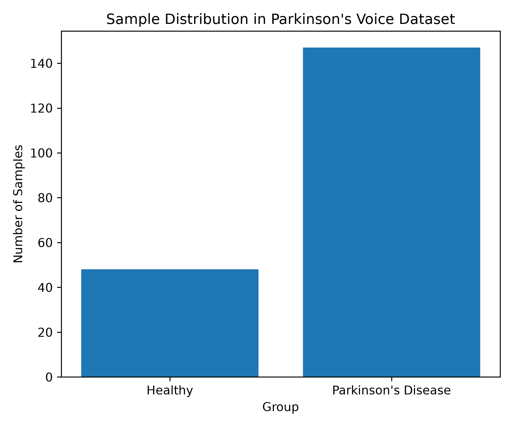

# Parkinson's Voice Biomarker ML

A machine learning-based biomedical data science project for exploring Parkinson's disease classification using voice measurement features.

---

## Project Overview

Parkinson's disease is a progressive neurodegenerative disorder that affects movement, speech, and motor control. Changes in vocal characteristics have been investigated as potential non-invasive biomarkers for early disease detection and monitoring.

This project utilizes a publicly available biomedical voice dataset from the UCI Machine Learning Repository and implements a structured machine learning workflow for Parkinson's disease classification.

The repository demonstrates data loading, exploratory analysis, visualization, model development, and performance evaluation using Python-based machine learning tools.

---

## Objectives

- Utilize real biomedical voice measurement data.
- Explore voice-derived biomarkers associated with Parkinson's disease.
- Perform dataset visualization and exploratory analysis.
- Develop machine learning classification models.
- Evaluate model performance using standard metrics.
- Present results through reproducible workflows and visualizations.

---

## Repository Structure

```text
parkinsons-voice-biomarker-ml/

README.md
requirements.txt

data/
    README.md
    raw/
        parkinsons.data
    processed/

notebooks/
    parkinsons_voice_analysis.ipynb

src/
    data_loader.py
    load_dataset.py
    visualization.py
    model_training.py

results/
    model_metrics.csv

figures/
    sample_distribution.png
```

---

## Dataset

**Dataset:** Parkinson's Disease Dataset

**Source:** UCI Machine Learning Repository

The dataset contains biomedical voice measurements collected from individuals diagnosed with Parkinson's disease and healthy controls.

### Dataset Summary

| Attribute | Value |
|------------|--------|
| Total Samples | 195 |
| Total Features | 24 |
| Classification Target | status |
| Healthy Subjects | 0 |
| Parkinson's Disease Subjects | 1 |

---

## Workflow

```text
Raw Biomedical Dataset
            ↓
Data Loading
            ↓
Exploratory Analysis
            ↓
Visualization
            ↓
Feature Selection
            ↓
Machine Learning Classification
            ↓
Model Evaluation
            ↓
Scientific Interpretation
```

---

## Technologies Used

- Python
- Pandas
- NumPy
- Matplotlib
- Scikit-learn
- Biomedical Data Science
- Machine Learning
- Data Visualization

---

## Results

### Machine Learning Model Performance

| Model | Accuracy | Precision | Recall | F1 Score |
|---------|---------|---------|---------|---------|
| Random Forest | 0.923 | 0.933 | 0.966 | 0.949 |

### Sample Distribution

The figure below illustrates the distribution of healthy and Parkinson's disease samples within the dataset.



---

## Key Findings

- The Random Forest classifier achieved an accuracy of 92.3%.
- Precision of 93.3% demonstrates reliable classification performance.
- Recall of 96.6% indicates strong sensitivity for Parkinson's disease detection.
- Results support the applicability of machine learning approaches in biomedical voice-based disease classification studies.

---

## Scientific Significance

Voice-based biomarkers represent a promising non-invasive approach for neurological disease screening. Machine learning methods can assist in identifying complex patterns within biomedical datasets and may contribute to future decision-support systems in healthcare and precision medicine.

---

## Future Development

Planned extensions include:

- Exploratory Data Analysis Notebook
- Feature Correlation Analysis
- Feature Importance Visualization
- Confusion Matrix Generation
- Logistic Regression Benchmark Model
- Support Vector Machine Classification
- Cross-Validation Analysis
- Hyperparameter Optimization
- Explainable AI Approaches
- Comparative Evaluation of Multiple Models

---

## Author

**Ishitta Sarkar**

B.Tech Biotechnology

### Areas of Interest

- Bioinformatics
- Computational Biology
- Biomedical Data Science
- Neuroinformatics
- Machine Learning for Biological Data
- Precision Medicine
- Computational Drug Discovery
